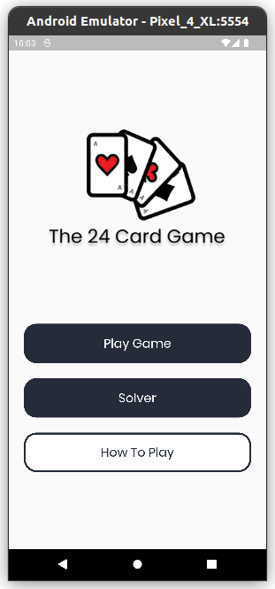
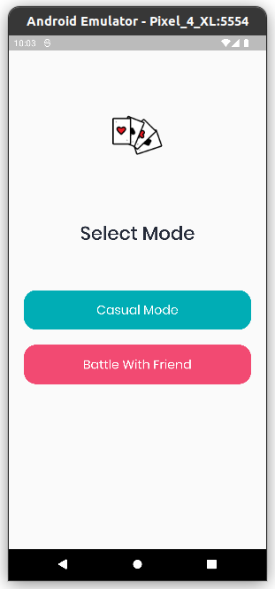
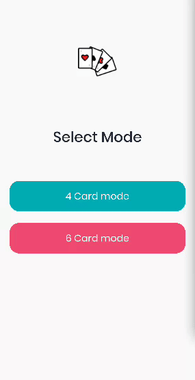
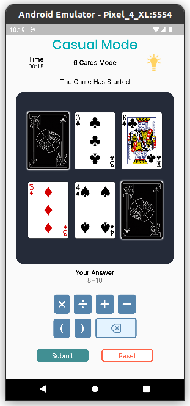
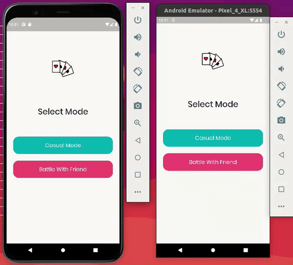
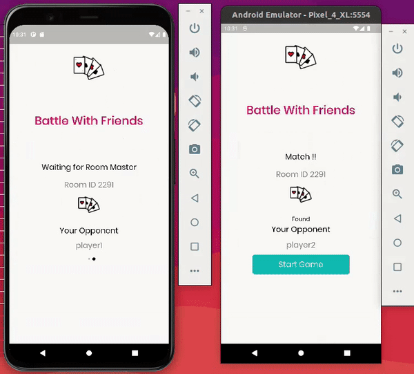
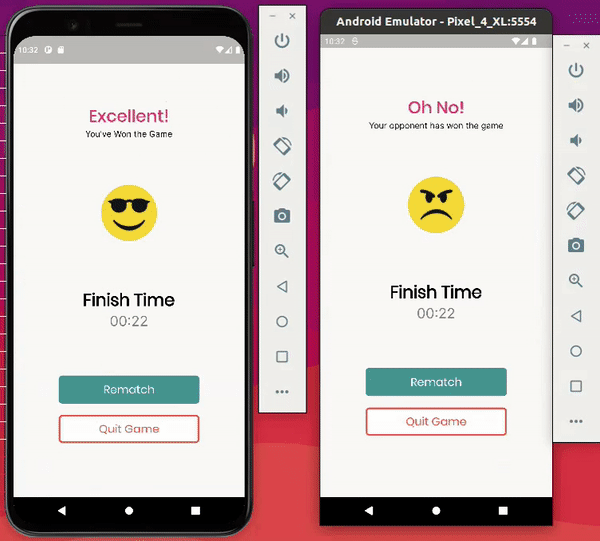

# 24 Game

UI design by [Rony Wahyu](https://github.com/ronywahyuu).  
App design by [Neo Jarmawijaya](https://github.com/neojarma).

## Objective

You have to make the number **24** from the given number in application. You can add, substract, multiply and divide. Use all numbers on the card, but use each number only once. You do not have to use all four operations.

## Little changes

1. Range of the given number will be numbers from **2 - 11**
2. Each numbers will be represented by poker card images.  
    > **ACE** card will have value **11** 

    > **Jack/Queen/King** will have value **10**

    > random cards from **3-9** will have value **3-9**

## Feature

1. Single player [4 cards or 6 cards]
2. Multi player [only 4 cards]
3. Solver [4 numbers or 6 six number]

## App Overview

> ## Single player

1. Home  

2. Game Mode  
    Here you can choose whether to play solo or multiplayer  

3. Gameplay (4 cards / 6 cards)  
  

> ## Multiplayer

1. Matchmaking  

1. Multiplayer Gameplay  

1. Rematch  

## API Reference

1. [24 Game Solver API](https://github.com/neojarma/24-Game-API)

2. [Deck of Cards](https://deckofcardsapi.com/)

## Dependencies

1. [Firebase Core](https://pub.dev/packages/firebase_core)
2. [Firebase Firestore](https://pub.dev/packages/cloud_firestore)
3. [Google Fonts](https://pub.dev/packages/google_fonts)
4. [Get](https://pub.dev/packages/get)
5. [Stop Watch Timer](https://pub.dev/packages/stop_watch_timer)
6. [Function Tree](https://pub.dev/packages/function_tree)
7. [Font Awesome](https://pub.dev/packages/font_awesome_flutter)
8. [Shared Preferences](https://pub.dev/packages/shared_preferences)
9. [Cached Network Image](https://pub.dev/packages/cached_network_image)
10. [Flutter Spinkit](https://pub.dev/packages/flutter_spinkit)

## How To Run
> ### git clone https://github.com/neojarma/24-Game.git

> ### cd 24-Game

> ### flutter packages get

> ### flutter run